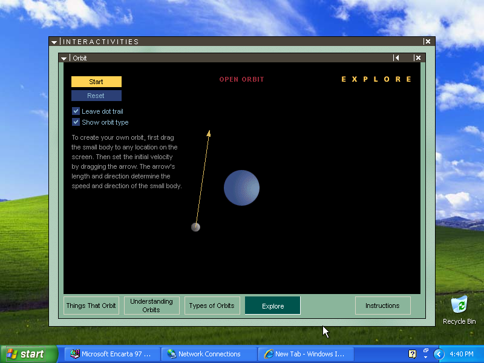
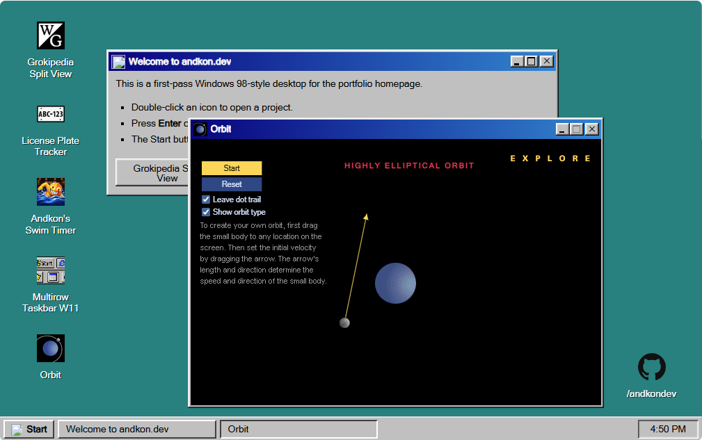

# Orbit

Orbit is a web port of the old Orbit game from the **Interactivities** section of Microsoft Encarta 97. It runs as a small browser canvas using extracted visual/audio assets from the original Encarta activity, then opens inside the fake desktop window on [andkon.dev](https://andkon.dev/).

The original Orbit activity running in Encarta 97 on Windows XP:

The web port running inside the fake desktop on andkon.dev:

## Play

- [andkon.dev](https://andkon.dev/) - open the fake desktop and double-click the Orbit icon.
- [andkon.dev/orbit](https://andkon.dev/orbit/) - launch the Orbit toy directly.

## Context

- [Kroc Camen on Mastodon](https://mstdn.social/@kroc/110590002099281528) - a post discussing the Orbit InterActivity.
- [Retrospective: Encarta 97](https://sonatano1.wordpress.com/2017/10/21/retrospective-encarta-97/) - a nostalgic write-up of Encarta 97 that mentions Orbit and the Interactivities collection.
- [Microsoft Encarta 97 Deluxe Edition on Internet Archive](https://archive.org/details/cd-1-enc-97-enc/) - archive entry for the Encarta 97 CD-ROM images used as historical source material.

## Files

- `index.html` - standalone `/orbit/` route.
- `embed.html` - black-box iframe used by the desktop window on the homepage.
- `orbit.js` - canvas simulation and interaction logic.
- `assets/` - extracted Orbit artwork, audio, and README screenshot.
